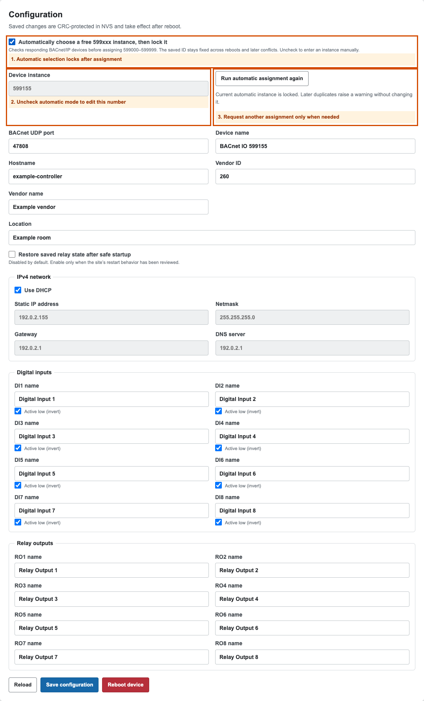

# Automatic BACnet instance assignment

Firmware 1.1.0 can choose an unused **599000–599999** BACnet Device instance
when a controller first joins the network. The chosen instance is saved and
**locked immediately**. Power cycles, DHCP changes, and later duplicate
devices do not change it.

BACnet does not provide a reliable notification that Metasys or another BAS
has adopted a device. Locking after successful assignment avoids depending on
discovery reads, subscriptions, or other guesses about adoption.

## Install and commission

1. Connect Ethernet and allow the controller to obtain an IP address.
2. Open the controller's web interface and select **BACnet & Status**.
3. Wait until **Instance assignment** says **Locked across reboots**. The first
   assignment normally takes about 6–7 seconds after Ethernet obtains an IP.
4. Record the **Device instance**, then discover and add the device in your BAS.

The controller broadcasts three Who-Is requests for the 599xxx range and
records I-Am replies. It chooses a free candidate, announces it, and checks
that candidate for another three seconds. A competing reply restarts discovery
with a different candidate. Address-dependent jitter and candidate selection
spread simultaneous controller startups. Only after the selected instance is
saved does the controller enable normal point services.



## Set an instance yourself

1. Load the admin key in **Relay Control**.
2. Open **Configuration**.
3. Uncheck **Automatically choose a free 599xxx instance, then lock it**.
4. Enter the desired **Device instance**. Manual values may use the complete
   valid range, **0–4194302**; ensure the value is unique across your BACnet site.
5. Choose **Save configuration**, then reboot the controller to apply it.

Manual instances remain unchanged until a user changes them.

## Request automatic assignment again

In **Configuration**, choose **Run automatic assignment again**, save, and
reboot. This explicitly releases the existing lock and repeats discovery.
Update the BAS device mapping if the resulting instance changes. Changing
other settings while automatic mode is locked does not release that lock.

## Later conflicts and unavailable devices

Every minute, the controller sends a Who-Is for its locked instance and also
listens for unsolicited I-Am messages. If another address claims that instance,
the status page shows **Duplicate detected — instance stays locked**. Resolve
the duplicate through the conflicting device's settings or explicitly request
another assignment. The warning records a conflict observed during the current
boot; it does not rename or reboot a commissioned controller.

Discovery can only account for devices that respond on the reachable BACnet/IP
network and configured UDP port. Offline devices, filtered broadcasts, and
unreachable subnets cannot be reserved by this process. Check the site's
instance allocation when commissioning. Cross-subnet discovery still requires
the site's BACnet router/BBMD configuration; this feature does not add BBMD or
foreign-device registration.

If all 1000 automatic values are occupied, the controller reports **No free
599xxx instance — retrying**, waits 30 seconds, and scans again. Management
HTTP and USB remain available so a user can select a manual instance. An NVS
save failure leaves normal BACnet services paused and reports the error. If
configuration changes during assignment, the firmware requests a reboot
instead of overwriting the user's changes.

## Existing firmware settings and API

Upgrades preserve the existing configuration layout, keys, network settings,
I/O names, and relay policy. A legacy manually chosen instance other than the
old factory default stays manual. The old shared factory instance **599153**
is checked once: retained and locked if free, replaced and locked if another
device responds with that instance. A factory-style device name follows a
changed automatic ID when that name remains unique; custom names stay intact.

`GET /api/v1/config` includes `device_instance_auto` and
`device_instance_locked`. `GET /api/v1/status` reports the active
`bacnet_device_instance`, `bacnet_instance_status`, and
`bacnet_instance_conflicts` count.

Authenticated partial configuration updates:

```json
{"device_instance_auto": false, "device_instance": 599155}
```

```json
{"device_instance_auto": true, "device_instance_reselect": true}
```

Both require a reboot to apply. A legacy update containing `device_instance`
without `device_instance_auto` is treated as an explicit manual assignment.
While automatic mode is enabled, an accompanying numeric instance is ignored
so a stale form cannot overwrite the chosen ID. Concurrent configuration
changes receive HTTP 409; reload the configuration and save again.
