# Flash your controller: illustrated beginner guide

**[Open the firmware installer](https://JimBoHa.github.io/ESP32-S3-PoE-ETH-8DI-8RO-C-BACnet-IP-Firmware/)**

You can install firmware 1.0.0 using buttons in Chrome or Edge. No programming
or command line is needed. Allow about 10–15 minutes, including an optional
backup. Keep this guide open in a second tab while you work.

**Already running this firmware?** Use the device’s **Firmware** tab for an
update that keeps settings. The USB installation below erases them.

[Start installation](#first-installation-with-screenshots) ·
[Fix connection problems](#connection-help) ·
[Recover a lost key](#recover-a-key-without-erasing-settings) ·
[Update over Ethernet](#later-firmware-updates)

## What you need

- The **ESP32-S3-POE-ETH-8DI-8RO-C**, with 16 MB flash and 8 MB PSRAM.
- A desktop computer running Chrome or Edge with Web Serial support. Safari,
  Firefox, and mobile browsers are not supported for USB flashing.
- A USB-C **data** cable. A charging-only cable will power the board but will
  not let your browser find it.
- An Ethernet cable connected to your router or network switch. The network
  should assign addresses automatically (DHCP).
- Power after installation: a compatible PoE network connection or the
  external supply specified for this board. Without another supply, leave USB
  connected to keep the controller powered.

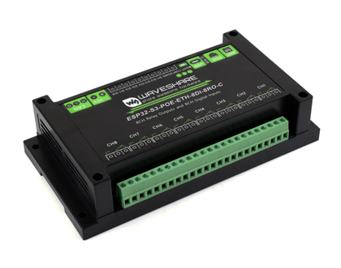

Photo: [Waveshare product reference](https://www.waveshare.com/esp32-s3-eth-8di-8ro-c.htm).
Match the entire label, including **POE** and **-C**. Chip detection checks
ESP32-S3 and 16 MB flash; it cannot identify the enclosure or relay wiring.

## Windows and Mac preparation

The same HTTPS installer is used on both platforms. Use a current desktop
Chrome or Edge browser. The browser opens the USB device directly; users do
not need Python, ESP-IDF, Docker, or a virtual machine.

| Windows | Mac |
|---|---|
| Connect the USB-C data cable and allow Windows to finish detecting the device. | Unlock the Mac and connect the USB-C data cable. |
| The browser picker may include a `COM` number alongside the USB device name. Select the Espressif USB serial device. | If macOS asks whether to allow the accessory, choose **Allow**. |
| If the picker is empty, check **Device Manager → Ports (COM & LPT)** for the controller's serial port. | If the picker is empty, close serial monitors and other browser tabs holding the port, then try another data cable or USB port. |
| Follow the [Espressif USB Serial/JTAG guide](https://docs.espressif.com/projects/esp-idf/en/v5.5.4/esp32s3/api-guides/usb-serial-jtag-console.html) if Windows does not expose a serial port. This is the board's native USB interface. | See [Apple's accessory permission instructions](https://support.apple.com/102282) if the accessory remains blocked. |

Automated Chrome/Edge browser tests pass on Windows and macOS. Physical USB
validation is recorded separately in [platform testing](PLATFORM_TESTING.md).
Browser support alone does not prove every USB cable, driver, or VM works.

## First installation, with screenshots

These screenshots are rendered from the actual application with isolated
example data. `192.0.2.140`, the example device identity, and sample I/O states
are not your controller's address or live readings. The native device picker
and file chooser vary with operating system and browser. Orange outlines,
numbered labels, and arrows show what to click. Click an image to enlarge it.
These annotations are added to the real page before its screenshot is taken.

### 1. Connect the controller

Disconnect controlled relay loads. Connect USB-C and open the
[USB installer](https://JimBoHa.github.io/ESP32-S3-PoE-ETH-8DI-8RO-C-BACnet-IP-Firmware/).
Click **Connect controller**, select **USB JTAG/serial debug unit** (or the
corresponding USB serial/COM device). Click that device row first, then click
**Connect** in the small browser dialog. A number such as **COM3** is normal
on Windows; yours may differ. If you click **Cancel**, nothing changes; choose
**Connect controller** again when ready.

**You should see:** **Controller connected** and a green **USB connected** badge.

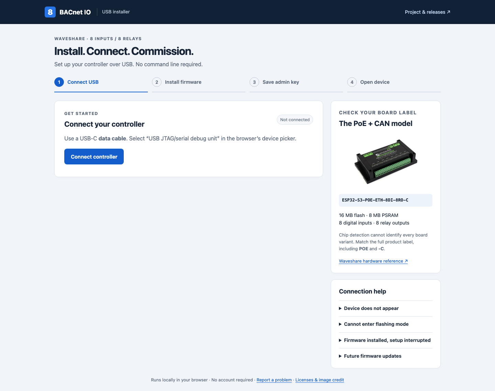

**Windows device picker:** click the controller row, then the blue **Connect**
button. The address at the top is the installer site you opened; this native
Windows screenshot uses the local test installer. Your COM number may differ.

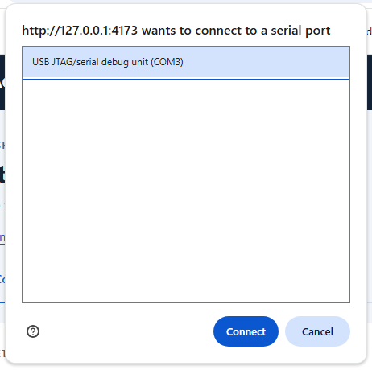

### 2. Confirm the board, back up, and select a release

Check that the full product label matches the board pictured. If you want a
recovery copy of the current firmware and settings, choose **Download backup**.
Wait for the completed full 16 MB download before proceeding. The backup may
contain private keys; keep it private.

Select the recommended firmware. Read the erase notice and tick its checkbox
when ready. Installation replaces firmware and erases saved settings,
including the admin key. Leave **Recommended** selected unless you have a
specific reason to install another version. The **Erase & install firmware**
button stays unavailable until both confirmation boxes are ticked.

**You should have:** the exact board confirmed, a finished backup if you
requested one, and the erase box ticked.

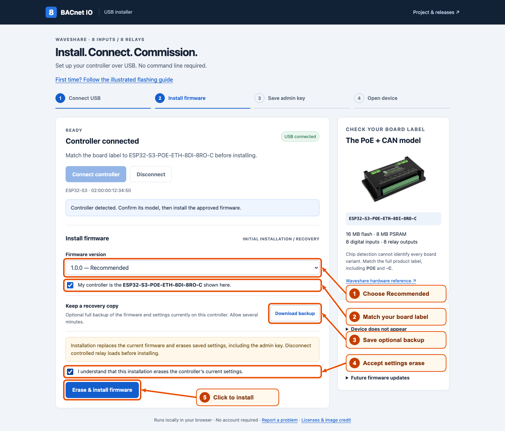

### 3. Install and wait for verification

Click **Erase & install firmware**. Keep USB connected and the tab open.
The installer checks the download's SHA-256, erases flash, writes the merged
image, verifies flash with MD5, and checks the running project's identity and
version. Wait for **Firmware installed** before continuing. Progress may pause
while flash is erased or the controller restarts. Do not refresh the page,
close the tab, or unplug USB while it is working.

**You should see:** **Firmware installed** and **WRITE & BOOT VERIFIED**.

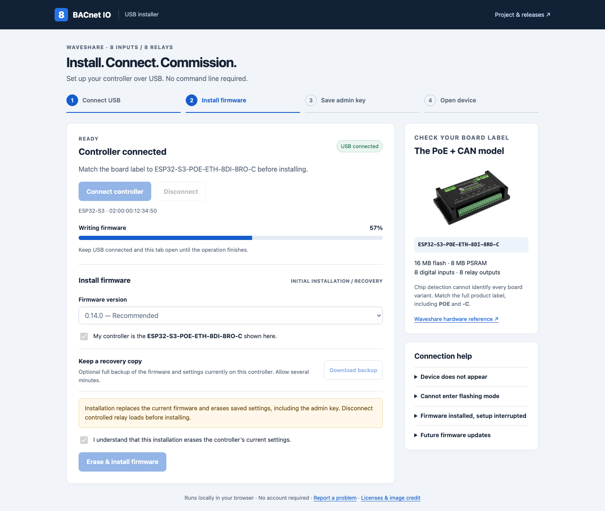

### 4. Save the new admin key and find the Ethernet address

Click **Download admin key**. Confirm that the `.key` file is saved in Downloads
and keep a private recovery copy. If the browser asks where to save it,
choose **Downloads**, then **Save**. The name begins with `bacnet-io-` and ends
with `-admin.key`. Do not open or edit its contents. Treat it like a password;
never post it in GitHub issues or screenshots.
Connect Ethernet to a network with DHCP. The installer shows the actual device
address when available, plus relay-controller and RTC health.
For immediate management access, wait for **Ethernet connected** and the
**Open device** button before finishing USB setup.

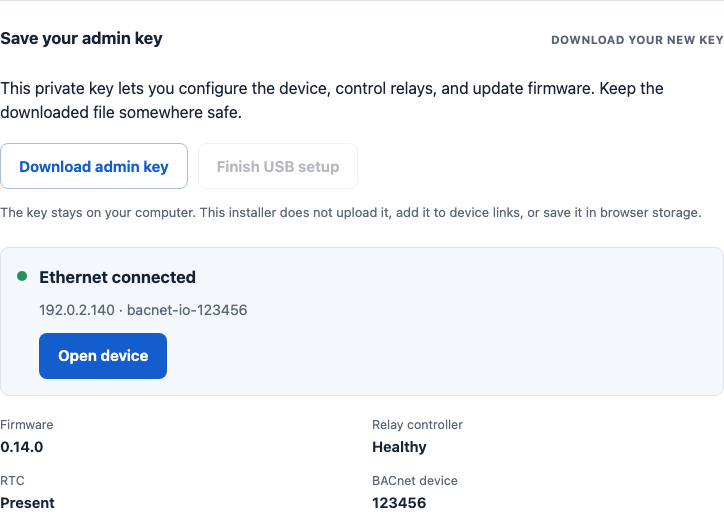

### 5. Finish USB setup

Once the key file is saved, click **Finish USB setup**. This locks key export
and releases the serial port. **USB setup complete** confirms this step.
Keep PoE or suitable external power connected when unplugging USB. The
**Finish USB setup** button becomes available after you download the key.

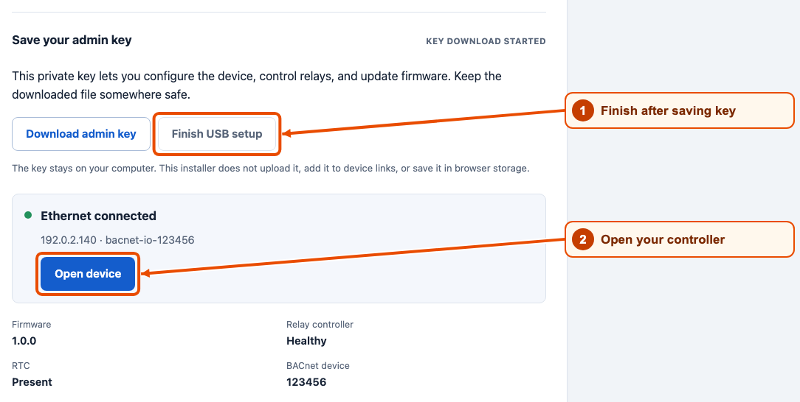

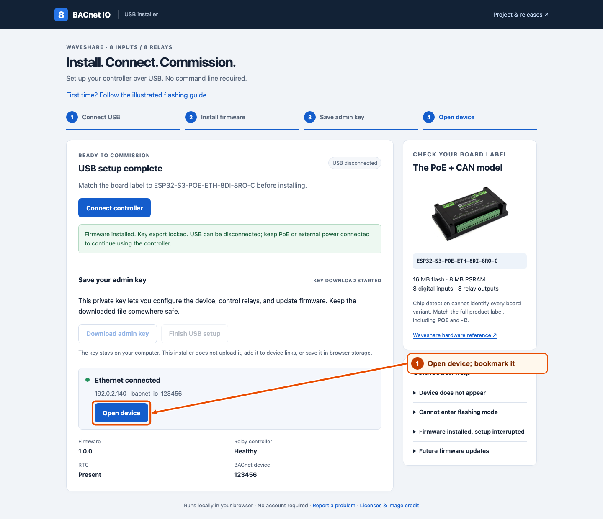

### 6. Open the device and load the key

Click **Open device**. On its **Relay Control** tab, choose **Load key file**
and select the downloaded `.key` file from **Downloads**. Click **Open** in
the file dialog. Do not select a `.bin` backup or a firmware image here.
Leave the key masked. The file is read
locally; only signed management requests leave the browser.

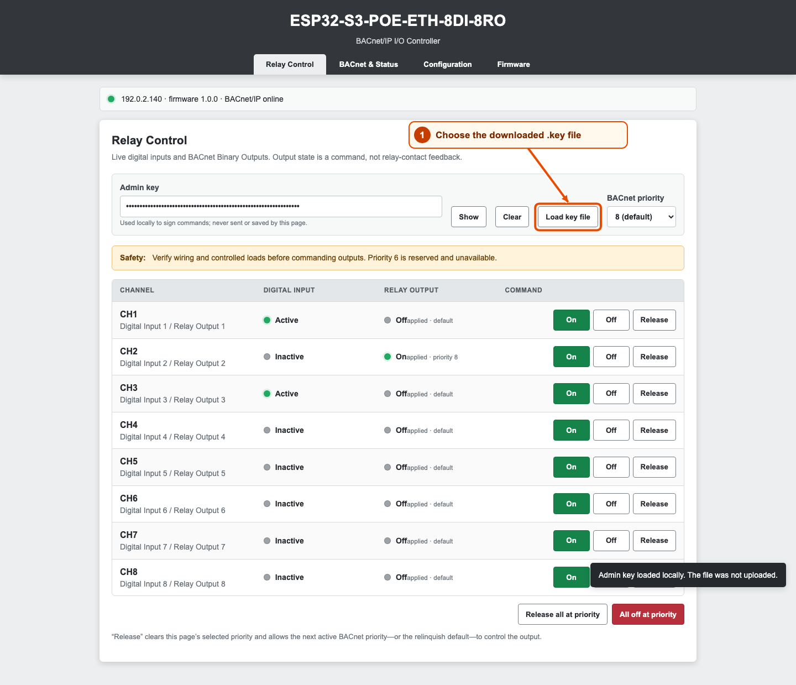

**Windows file picker:** select your `.key` file, then click **Open**. This
cropped native Windows example uses a dedicated test folder. On your computer,
choose the key you saved in **Downloads**; its name and folder will differ.

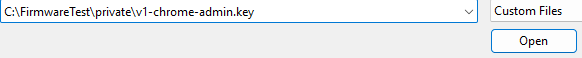

**You should see:** a green connection indicator, version **1.0.0**, and
**Admin key loaded locally**. The key box shows dots. Bookmark this device
page; use the actual address shown on your screen, not the example address
in the screenshots. Reloading the page means loading the key file again.

Use [the interface tour](INTERFACE_GUIDE.md) for relay control, status,
configuration, and later Ethernet updates.

If PoE or suitable external power remains connected, you may disconnect USB
after setup finishes. If USB is the only supply, removing it turns the device
off. The installer shows relay-controller and RTC health; commissioning still
requires the site's BACnet, input, and relay checks.

## Recover a key without erasing settings

With firmware 0.14.0 or newer, connect USB and choose **Connect controller**.
Existing firmware is detected without erasing or resetting it. If key export
is locked, **hold BOOT for three seconds while firmware is running, then
release it**. Download the key within 60 seconds and finish USB setup.

Do not press RESET during this recovery step. BOOT held across RESET enters
the ROM downloader instead. If that happens, release BOOT and tap RESET.

A newly generated key can be downloaded for five minutes during its first
boot. A reset, power cycle, or **Finish USB setup** closes that initial window.
The key does not change during recovery or an Ethernet update. If a key is
compromised, an intentional erase/reinstall generates a replacement and
removes the old settings.

## Connection help

| Symptom | Next step |
|---|---|
| USB button unavailable | Open the HTTPS installer in desktop Chrome/Edge. |
| Empty device picker | Try a known data cable and another USB port; close serial monitors and other installer tabs. Allow the USB accessory if macOS prompts. |
| Cannot enter flashing mode | Keep USB connected. Hold **BOOT**, tap **RESET**, then release **BOOT**. Connect again. |
| Backup fails | Nothing has been erased. Disconnect and reconnect in the installer, then retry. Incomplete or checksum-failing backups are never offered for download. |
| Flash transfer interrupted | Reconnect and repeat installation. A partially written image may not boot, but the ROM USB downloader remains available. |
| Flash verified, USB setup interrupted | Disconnect and reconnect in the installer. A successful flash does not need another erase; use BOOT key recovery if the first-boot window expired. |
| No Ethernet address | Check Ethernet, DHCP, switch VLAN, and PoE. While USB setup is connected, the page polls for an address and shows the MAC for DHCP lease lookup. If setup has already finished, reconnect here to discover the address; your saved key remains valid. |

The browser can save a complete flash backup, but this installer deliberately
accepts only approved release images for writing. Restoring a private full
backup is an advanced recovery operation: use esptool to write it at `0x0`,
following [commissioning and recovery](COMMISSIONING.md), or ask a maintainer.
That restores the old firmware, settings, and key together.

## Later firmware updates

Use Ethernet updates to keep the controller’s settings and admin key.
USB reinstallation erases both.

1. Open the device’s bookmarked web page. On **Relay Control**, use **Load key
   file** to load its saved `.key` file.
2. Open the [latest release](https://github.com/JimBoHa/ESP32-S3-PoE-ETH-8DI-8RO-C-BACnet-IP-Firmware/releases/latest).
   Download the **`.zip` firmware package** under **Assets**. In Windows,
   right-click it and choose **Extract All**; on Mac, double-click it.
   Inside the extracted folder, find **firmware-ota.bin**.
3. Return to the device and click its **Firmware** tab. Under **OTA application
   image**, click **Choose File** (some browsers say **Browse**). Select
   **firmware-ota.bin** and click **Open**.

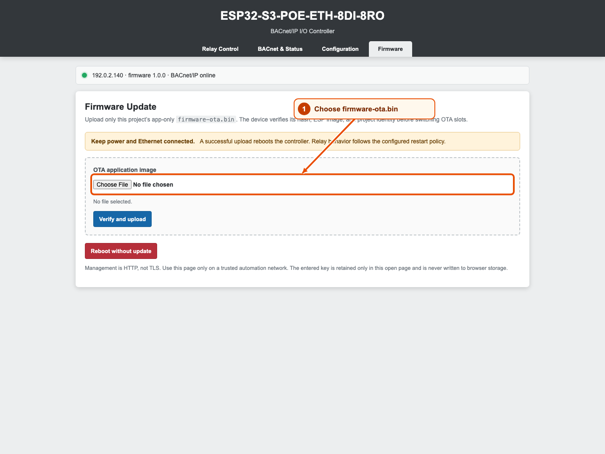

**Windows file picker:** the filename should end in **firmware-ota.bin**.
Click **Open**. This example uses the test folder; choose the image inside
the ZIP folder you extracted on your computer.

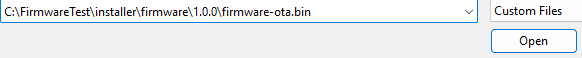

4. Check the version shown below the file selector. Click **Verify and upload**,
   then approve the browser’s update confirmation. Keep power and Ethernet
   connected while the controller restarts.

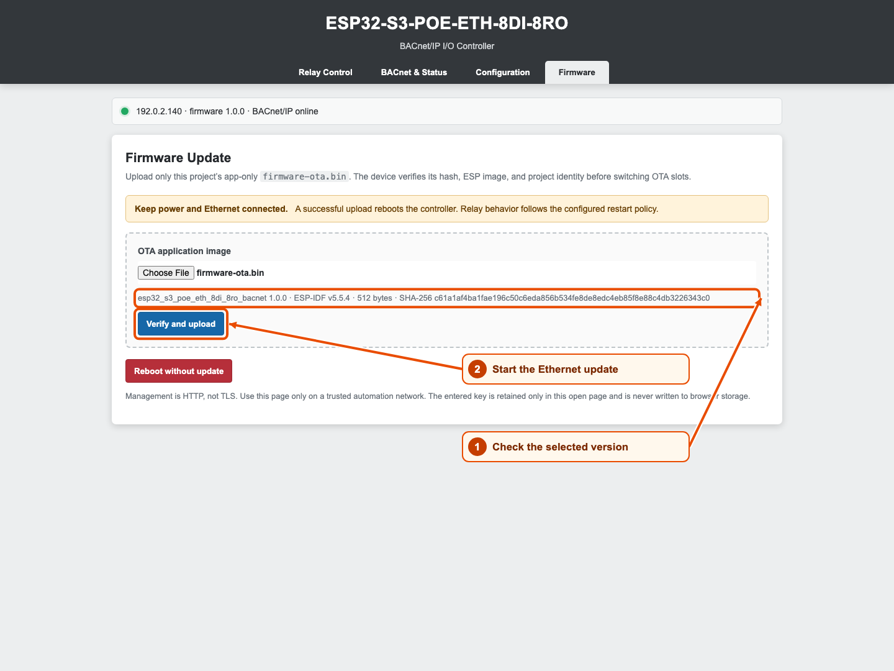

5. Wait for the green connection indicator to return. Refresh the device page
   if needed. Check the new version on **BACnet & Status** and load the same
   key file again before making further changes.

Use **firmware-ota.bin** for this step. **initial-flash.bin** and full recovery
backups belong to USB flashing and cannot be uploaded through Ethernet.

## Maintainer: publish without a command line

To publish a new tested version:

1. Open repository **Settings → Pages**. Set **Build and deployment → Source**
   to **GitHub Actions**. Ensure the `github-pages` environment permits your
   stable release tags (for example `v*`), not only `main`.
2. Open **Releases → Draft a new release**. Choose the tested commit and a tag
   matching `PROJECT_VER`, such as **v1.0.0**. Keep draft/prerelease
   builds unpublished until approved. Publish a stable release to promote it.
3. Watch **Actions → Publish browser installer**. It builds the tagged
   firmware with ESP-IDF 5.5.4, runs host/browser tests, verifies packages,
   attaches matching `bacnet-io-vX.Y.Z.zip` and `.tar.gz` packages, and deploys
   the HTTPS installer. The ZIP opens with Windows and Mac's built-in tools.
4. Open the installer link from the README and confirm the recommended
   version. Test on a spare controller before recommending a release to users.

The release workflow retains up to four older stable releases that have
compatible installer packages. It does not overwrite an existing release
asset; rerunning uses that original verified package. Use a new version for
changed firmware. Drafts, prereleases, and versions before 0.14.0 are excluded.
To recommend a prior release again, open **Actions → Publish browser installer
→ Run workflow**, run from `main`, and enter its published tag.

Pull requests only build downloadable preview artifacts. They do not publish
GitHub Pages or create a release. No PAT is embedded in the installer or
workflow; publishing uses GitHub's scoped workflow token. GitHub Pages setup
and a real public deployment must be verified after merge.

## Local development and tests

Build firmware using the repository's ESP-IDF instructions, then:

```sh
python tools/package_release.py
python tools/prepare_installer.py --release-dir release/v1.0.0 --recommended 1.0.0
cd installer
npm ci
npm test
npx playwright install chromium
npm run test:browser
npm run build
npm run preview
```

Use the localhost preview URL for physical USB testing. A `file://` page or
ordinary HTTP remote host does not provide the required secure context.
Relative assets support GitHub Pages' repository subpath without a custom
domain or runtime CDN. Serve the complete `installer/dist/` directory.

Automated browser tests substitute the device adapter with an isolated test
fixture; firmware integrity, protocol, and policy tests run separately. These
tests do not substitute for a physical USB backup/flash/boot/key test. The
production bundle contains no simulated devices or test credentials.

To refresh the documentation screenshots, run `npm run screenshots` from
`installer/` after installing the Playwright Chromium browser. The capture
script renders the real interfaces against isolated example fixtures, blocks
external requests, and writes PNG files plus capture metadata to `docs/images/`.
It does not connect to or change a controller. Review every image before committing.

## USB setup protocol and implementation

The browser uses [Espressif esptool-js](https://github.com/espressif/esptool-js)
for ROM discovery, stub loading, erase, flash, and verification. Version 0.6.1
is pinned, with the maintained ESP32-S3 RAM loader from
[esp-flasher-stub 1.2.2](https://github.com/espressif/esp-flasher-stub/tree/v1.2.2)
replacing its legacy stub binaries. The adapter uses a bounded, linear-time SLIP packet decoder,
supplies an actual RTS reset pulse, and implements the
documented stub backup read with at most one unacknowledged block. Backups
use 256 KiB chunks, bounded retries, per-chunk MD5, and a final whole-flash MD5
check; damaged or inconsistent snapshots are never downloaded. The legacy
stub lost USB bytes during Windows testing; the maintained loader passed the
same diagnostic reads. See [platform testing](PLATFORM_TESTING.md) for the
complete installation results and hardware coverage.

The running firmware accepts bounded lines on native USB Serial/JTAG:

```text
BACNET-USB/1 0123456789abcdef STATUS
BACNET-USB/1 0123456789abcdef KEY
BACNET-USB/1 0123456789abcdef LOCK
```

Replies begin on a fresh line with `BACNET-USB/1 ` followed by JSON containing
`id`, `protocol: 1`, and `ok`. `STATUS` includes firmware identity, Ethernet MAC
and address, hostname, device instance, RTC/relay health, and export-window
state. `KEY` adds `admin_key` only inside a physically authorized window;
otherwise it returns `error: "key_locked"`. `LOCK` closes the window.

The parser requires an exact lowercase 16-hex request ID and known command,
accepts LF/CRLF, and discards invalid/oversized input through the next newline.
Key replies go only to native USB, never HTTP, UART logs, browser storage,
analytics, or URLs. See [security model](SECURITY.md) for physical access and
trusted-management-network assumptions.
