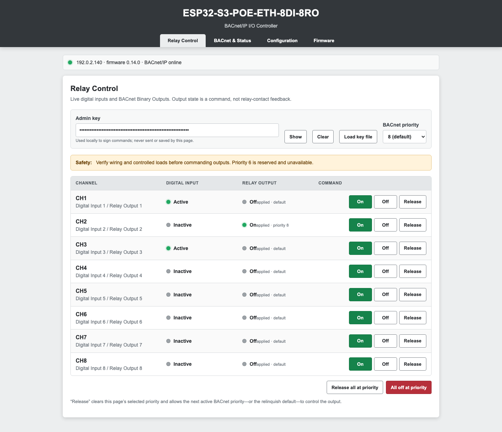
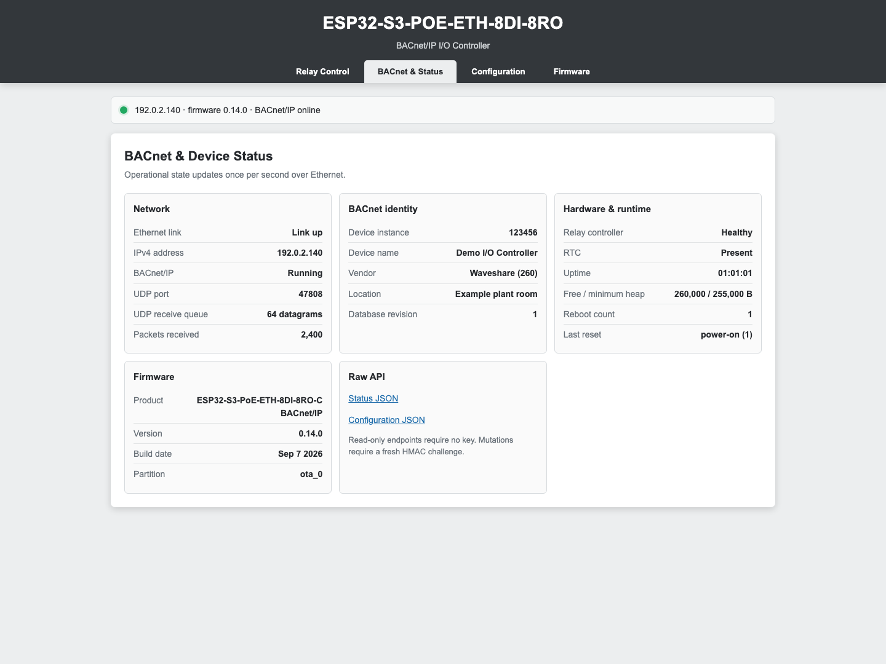
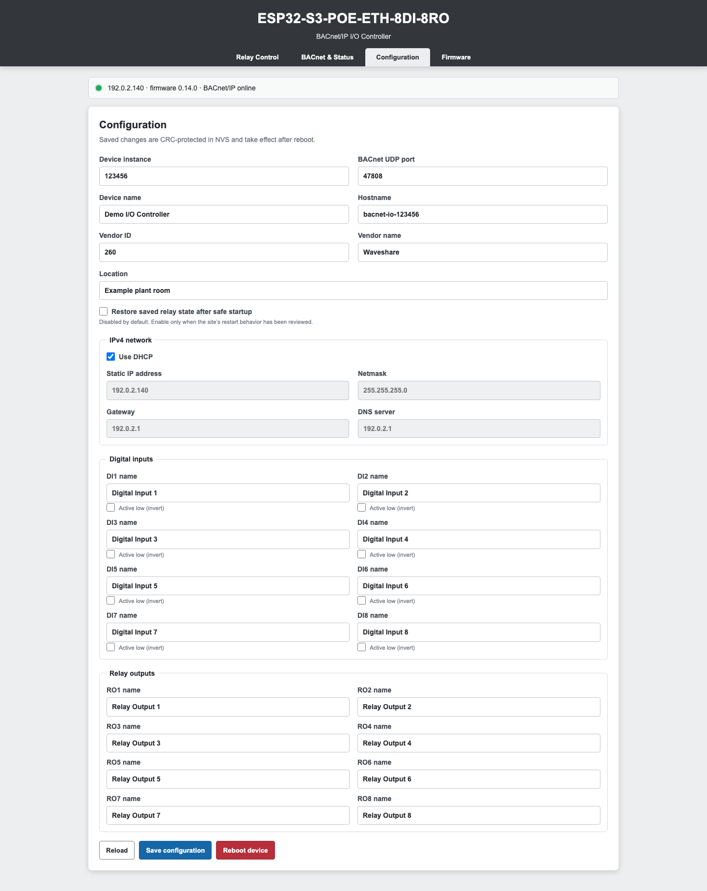
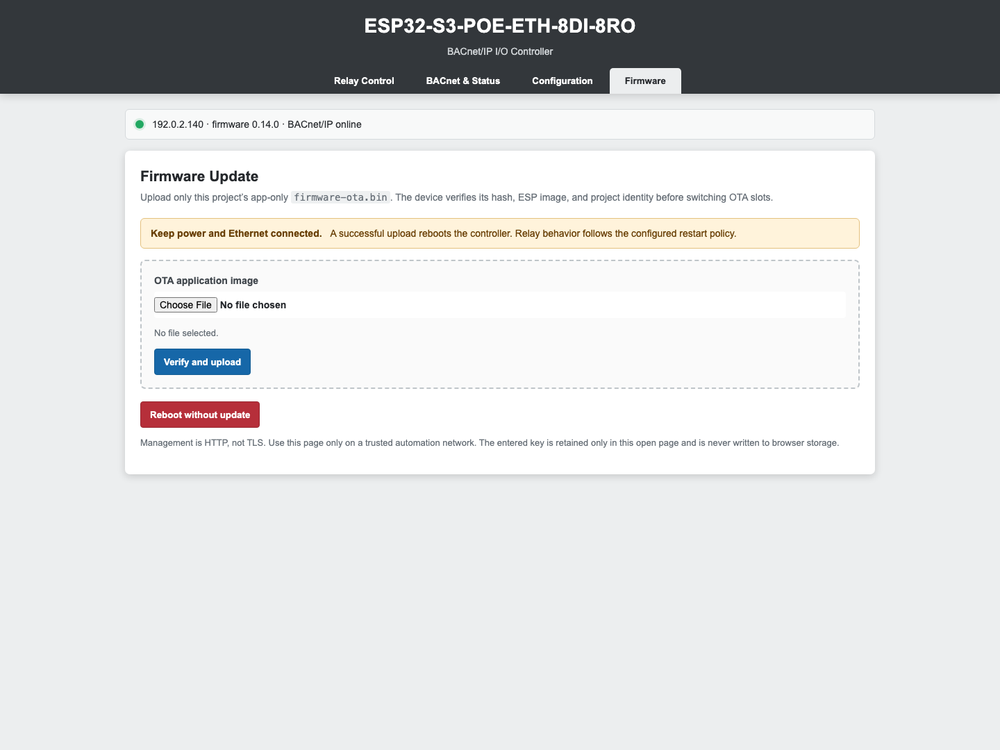

# Firmware interface tour

The controller serves its management interface at the Ethernet address shown
by the USB installer. Open that address from the same reachable automation
network. No desktop application is needed for routine monitoring or updates.

The screenshots below show firmware 0.14.0's actual interface with example
data. The address, names, input states, and relay commands are illustrative;
no live controller or real key was used to create these images.

## Relay Control

See all eight digital inputs and all eight Binary Outputs together. Green
**Active** indicates an active input; green **On** indicates an output command.
The displayed output state does not measure the physical relay contacts.

Choose **Load key file** to open the `.key` file saved during USB setup. The key
stays masked and is used locally to sign management requests. Choose the
BACnet priority before issuing **On**, **Off**, or **Release**. Priority 8 is
the page's default; priority 6 is reserved and unavailable. **Release** clears
the selected priority so the next active priority, or relinquish default,
can control that output. Bulk controls apply at the selected priority too.

Verify the connected loads before commanding a relay. Use **Clear** when
finished managing the device, especially on a shared computer.

## BACnet & Status

Inspect Ethernet and BACnet/IP availability, the device's IPv4 address,
device instance, UDP port and receive queue, and received packet count.
Hardware cards report relay-controller health, RTC presence, uptime, heap,
and reboot history. The firmware card identifies the version and running OTA
partition. Status and configuration JSON links support read-only inspection.

## Configuration

Set the BACnet device instance, UDP port, device name, hostname, vendor fields,
and location. Device instances and network settings must fit the site's BAS
plan. DHCP is enabled by default; disabling it enables the static IPv4 fields.
Changing the address may require opening a different device URL after reboot.

Name each input and output. **Active low (invert)** changes an input's logical
polarity; it does not change its electrical wiring requirements. Relay-state
restoration is disabled by default and should follow the site's restart policy.

Load the key first, choose **Save configuration**, review the confirmation,
and reboot to apply the saved settings. **Reload** discards unsaved form edits
by reading the saved configuration again. See the [hardware guide](HARDWARE.md)
for input wiring and electrical limits.

## Firmware

For routine updates, download the project's app-only `firmware-ota.bin` from
an approved release. Load the key on **Relay Control**, open **Firmware**, and
choose the file. The page shows its identity and hash. Choose **Verify and
upload** and confirm the update; keep Ethernet and power connected.

A successful update reboots into the other OTA slot and preserves the saved
key and settings. Refresh the page after the device returns, then reload the
key file before issuing further commands. Never choose `initial-flash.bin`
or a full recovery backup here; those are USB recovery images.

For the complete first-installation sequence, use the
[illustrated USB installation guide](BROWSER_INSTALLER.md).
